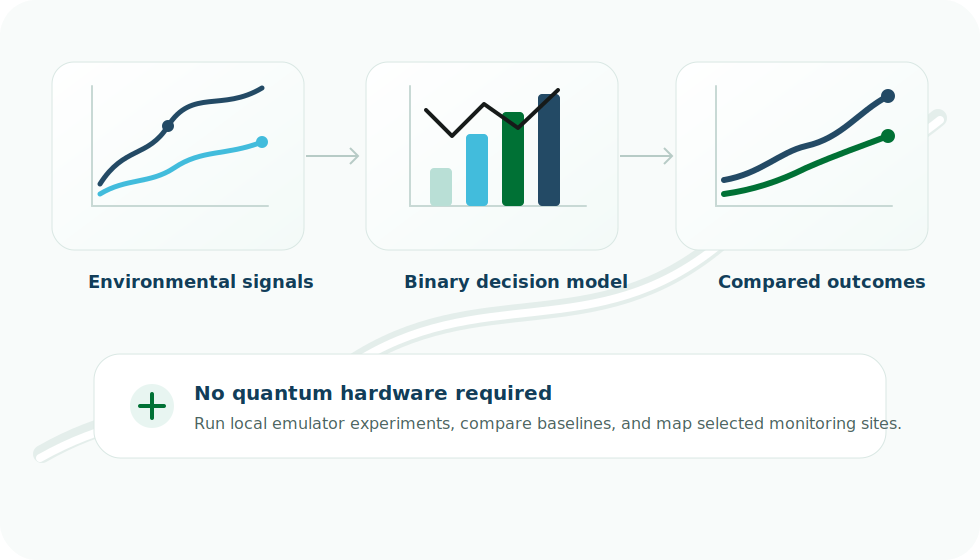

<section class="qe-hero" markdown>

# Quantum Emulator for Environmental Data Science

Turn environmental data into site-selection experiments you can run locally.

Harmonized layers become a decision table. The decision table becomes a QUBO.
The emulator selects sites, compares against a classical baseline, and maps the
tradeoffs back to geography.

[Run the demo](run-the-demo.md){ .md-button .md-button--primary }
[See the comparison](interpret-results.md){ .md-button }

<figure class="qe-hero-visual">
  
</figure>
</section>

Harmonize
Build QUBO
Emulate
Compare
Map

## What You Will Practice

* Turning environmental layers into candidate monitoring sites.
* Representing a yes/no site choice as a binary variable.
* Rewarding biological value and environmental coverage.
* Penalizing redundant sites and high implementation cost.
* Running a local quantum-inspired emulator on classical hardware.
* Comparing results with a transparent greedy baseline.

## Honest Framing

This project does not claim quantum advantage. It is about learning how ESIIL
working groups, ecologists, geospatial analysts, and environmental data
scientists can prepare decision problems in forms that are quantum-ready.

AI agents still matter here: they can help harmonize and prepare environmental
data. Quantum-inspired optimization then helps explore the decision space that
comes after harmonization.
