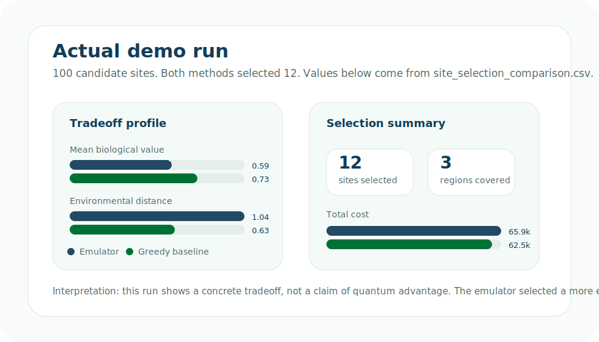
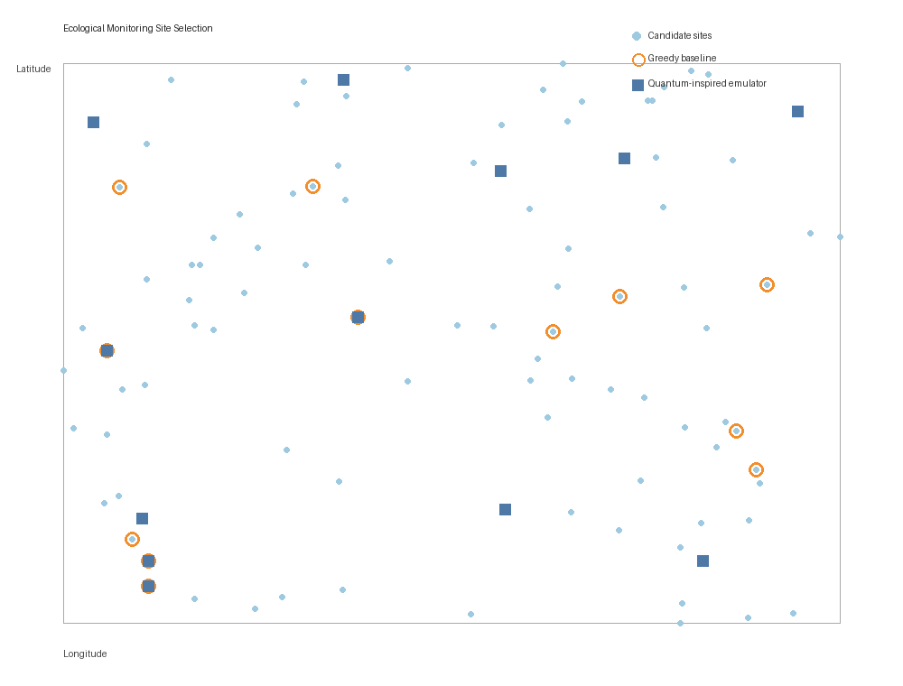

<section class="qe-hero" markdown>

# Quantum Emulator for Environmental Data Science

Turn environmental data into site-selection experiments you can run locally.

Harmonized layers become a decision table. The decision table becomes a QUBO.
The emulator selects sites, compares against a classical baseline, and maps the
tradeoffs back to geography.

[Run the demo](run-the-demo.md){ .md-button .md-button--primary }
[See the comparison](interpret-results.md){ .md-button }

<figure class="qe-hero-visual">
  
</figure>
</section>

Harmonize
Build QUBO
Emulate
Compare
Map

## Actual Demo Result

These figures come from the checked-in ecological monitoring demo run, not a
mockup. The emulator and greedy baseline each selected 12 sites from 100
synthetic candidate monitoring locations.

<figure markdown>

<figcaption>Selected monitoring sites mapped back to geography.</figcaption>
</figure>

### What changed between methods?

| Metric | Emulator | Greedy baseline |
|---|---:|---:|
| Sites selected | 12 | 12 |
| Mean biological value | 0.59 | 0.73 |
| Total cost | 65,913 | 62,529 |
| Environmental distance | 1.04 | 0.63 |
| Regions represented | 3 | 3 |

The emulator run selected a more environmentally spread-out network. The greedy
baseline selected a lower-cost network with higher mean biological value. That
tradeoff is the point of the exercise: compare candidate decisions, then decide
which tradeoff makes scientific sense.

[Download comparison CSV](assets/workflows/ecological_monitoring_demo/site_selection_comparison.csv){ .md-button }

## What Emulation Means Here

The emulator is a local training stand-in for quantum-ready optimization. It
does not run on quantum hardware. It takes the same kind of binary decision
model that quantum-inspired or hybrid solvers can use, then explores solutions
on classical hardware so researchers can learn the workflow now.

For EDS scientists, the useful part is the experiment loop: change the site
selection objective, rerun the emulator, compare against a baseline, and inspect
how the selected monitoring network changes. That makes tradeoffs visible before
anyone commits to a sampling design, conservation priority, or working-group
scenario.

## What You Will Practice

* Turning environmental layers into candidate monitoring sites.
* Representing a yes/no site choice as a binary variable.
* Rewarding biological value and environmental coverage.
* Penalizing redundant sites and high implementation cost.
* Running a local quantum-inspired emulator on classical hardware.
* Comparing results with a transparent greedy baseline.

## Honest Framing

This project does not claim quantum advantage. It is about learning how ESIIL
working groups, ecologists, geospatial analysts, and environmental data
scientists can prepare decision problems in forms that are quantum-ready.

AI agents still matter here: they can help harmonize and prepare environmental
data. Quantum-inspired optimization then helps explore the decision space that
comes after harmonization.
